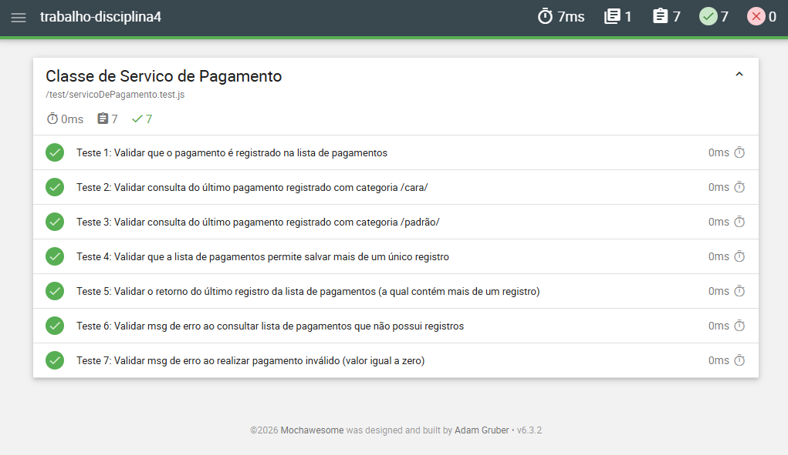

# Trabalho Disciplina 4 - Pipeline de Integração Contínua com GitHub Actions

## Visão Geral:
  Este projeto demonstra a implementação de uma pipeline de Integração Contínua (CI) utilizando GitHub Actions, aplicada a um projeto Node.js com testes automatizados em JavaScript.
  A aplicação contém a classe "ServicoDePagamento", responsável por simular regras de pagamento, com uma suíte de testes automatizados desenvolvida com Mocha.
  A pipeline foi configurada para executar testes automaticamente e gerar relatórios em diferentes formatos, além de publicar os resultados como artefatos no GitHub Actions.

## Tecnologias Utilizadas
  - Node.js
  - JavaScript
  - Mocha
  - mocha-junit-reporter
  - Mochawesome
  - Git
  - GitHub Actions
 
 
## Estrutura do Projeto
	.
	├── .github/
	│   └── workflows/
	│       └── template-ci.yml
	├── src/
	│   └── servicoDePagamento.js
	├── test/
	│   └── servicoDePagamento.test.js
	├── docs/
	│   └── test-report.png
	├── test-results/
	├── .mocharc.json
	├── package.json
	├── README.md
	└── .gitignore

## Como executar o projeto
  1. Clonar o repositório: git clone https://github.com/alinebrocker/trabalho-disciplina4.git
  2. Acessar o diretório: cd trabalho-disciplina4
  3. Instalar dependências: npm install
  4. Executar os testes: npm test
  5. Gerar relatório visual (HTML): npm run test:report

## Testes Automatizados
  Os testes foram implementados com o framework Mocha, validando o comportamento da classe ServicoDePagamento.
  A suíte garante a validação das regras de negócio e assegura o funcionamento esperado da aplicação.

## Relatórios de Testes
  O projeto gera dois tipos de relatórios:

  1. Relatório técnico (CI)
    - Formato: JUnit XML
    - Ferramenta: mocha-junit-reporter
    - Uso: integração com pipeline GitHub Actions
	
    Arquivo gerado: test-results/resultsTrabalho4.xml
	
  2. Relatório visual (HTML)
	- Ferramenta: Mochawesome
	- Formato: HTML + JSON
	- Uso: visualização amigável dos testes
	
	Arquivo gerado: "test-results/reportHTML.html"

## Pipeline de Integração Contínua
  A pipeline foi implementada utilizando GitHub Actions e automatiza todo o fluxo de testes.

  - Gatilhos da pipeline
	Push na branch "main"
	Execução manual via "workflow_dispatch"
	Execução agendada via "schedule" (cron)

## Etapas da pipeline
  1. Checkout do código
  2. Configuração do Node.js
  3. Instalação de dependências
  4. Execução dos testes (Mocha)
  5. Geração do relatório XML (CI)
  6. Geração do relatório HTML (visual)
  7. Publicação dos relatórios como artefatos
 
 
## Publicação de Artefatos
  Ao final de cada execução, a pipeline publica os relatórios gerados utilizando: "actions/upload-artifact@v4"

  Os artefatos ficam disponíveis na aba: "GitHub > Actions > Download Artifacts"

  Conteúdo do artifact:
	- resultsTrabalho4.xml
	- reportHTML.html
	- reportHTML.json

  Exemplo de Relatório utilizando Mochaesome:
  
  

## Conceitos Aplicados
  - Integração Contínua (CI)
  - Pipeline as Code
  - Automação de testes
  - GitHub Actions
  - Execução por eventos (push, manual e schedule)
  - Geração de relatórios de testes
  - Publicação de artefatos
  - Testes automatizados com Mocha
  
  
## Autoria
  Projeto desenvolvido por Aline Brocker Velho como atividade prática da disciplina de Integração Contínua.